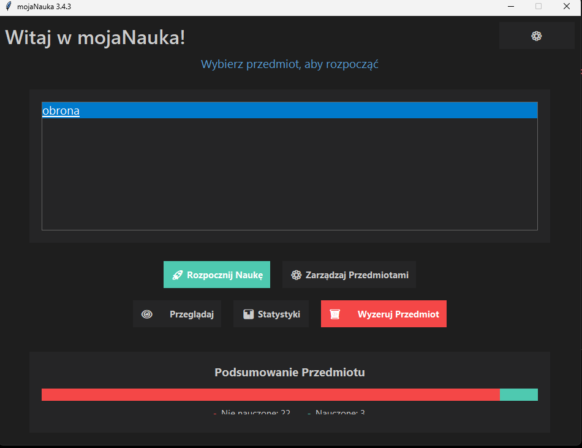
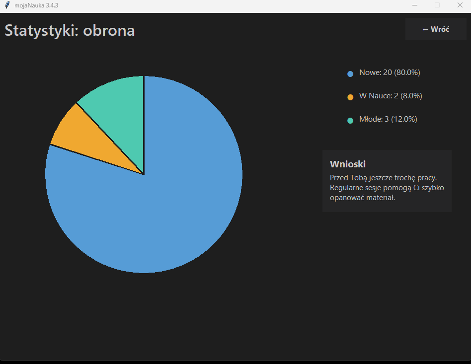
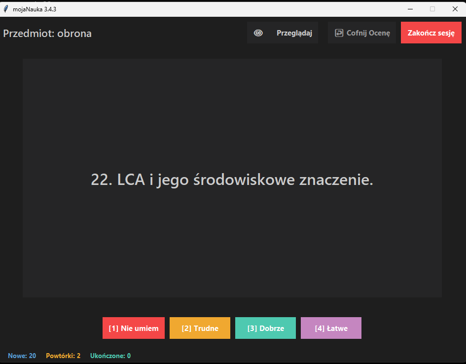

# 🎓 mojaNauka

**mojaNauka** to nowoczesna aplikacja edukacyjna z systemem powtórek SRS (Spaced Repetition System), stworzona z myślą o studentach, uczniach i wszystkich uczących się — szczególnie przydatna w przygotowaniach do egzaminów, kolokwiów i obrony pracy.

> ✨ Aplikacja napisana w Pythonie z użyciem `tkinter` i `pygame`, działa lokalnie, bez potrzeby internetu.

---

## 🖼️ Podgląd aplikacji

| Ekran powitalny | Statystyki nauki |
|------------------|------------------|
|  |  |

| Nauka kart | Przegląd kart |
|-------------|----------------|
|  |  |

---

## 🚀 Funkcje aplikacji

- 🔁 **System powtórek SRS** – uczy tylko tego, co naprawdę trzeba utrwalić
- 📊 **Statystyki i wykresy** – monitoruj swoje postępy i zobacz, co już umiesz
- 🗂️ **Przegląd i edycja kart** – dodawaj pytania, edytuj, resetuj
- 🎨 **Motyw jasny i ciemny** – dopasuj wygląd do swoich preferencji
- 🔉 **Dźwięki akcji** – dla lepszego zaangażowania (można wyłączyć)
- ⏱️ **Tryb z czasem** – opcjonalny limit na odpowiedź (idealny na stresującą obronę!)

---

## 📦 Wymagania

- Python 3.8+
- Biblioteka [pygame](https://pypi.org/project/pygame/)

Instalacja zależności:

```bash
pip install pygame
python main.py
mojaNauka/
├── main.py               # główna aplikacja
├── settings.json         # ustawienia użytkownika (motyw, dźwięk, timer)
├── progress_<nazwa>.json # zapis postępów nauki
├── decks/                # folder z taliami kart (plik .txt = 1 talia)
├── sounds/               # opcjonalne dźwięki (flip.wav, correct.ogg itd.)
├── img/                  # zrzuty ekranu do README
├── README.md
└── .gitignore


💡 Przykładowe zastosowania:
📚 Przygotowanie do obrony pracy dyplomowej
🧠 Nauka pojęć i definicji
📝 Powtarzanie materiału przed egzaminem
🎯 Utrwalanie wiedzy w małych dawkach (microlearning)


🧑‍💻 Autor
Stworzone z pasją przez Arychats (GitHub)
📅 wersja: mojaNauka 3.4.3
📍 rok: 2025
